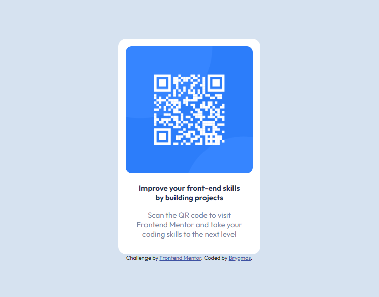

# Frontend Mentor - QR code component solution

This is a solution to the [QR code component challenge on Frontend Mentor](https://www.frontendmentor.io/challenges/qr-code-component-iux_sIO_H). Frontend Mentor challenges help you improve your coding skills by building realistic projects.

### Screenshot

### Built with

- Semantic HTML5 markup
- CSS custom properties
- Flexbox

## Author

- Website - [My projects](https://www.your-site.com)
- Frontend Mentor - [@brygmos](https://brygmos.netlify.app/)
- Twitter - [@russkikh_d](https://www.twitter.com/yourusername)
